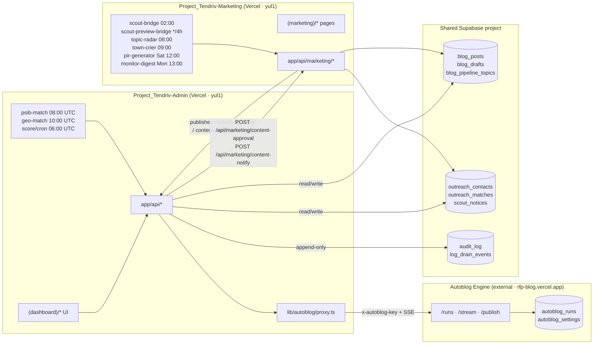
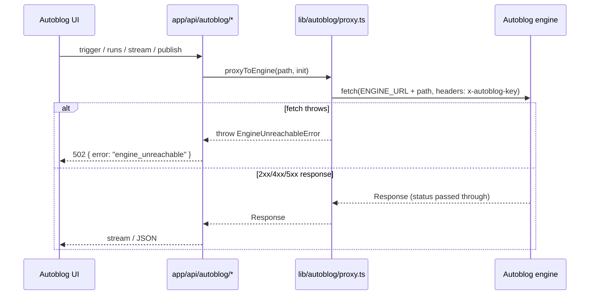

# Cross-repo architecture

How the admin app connects to the external Autoblog engine, the
marketing site, and the shared Supabase project.

## System map

## Cross-system contracts (drift-prone)

| Boundary | Owner of truth | Mirror in this repo | Risk |
|---|---|---|---|
| `autoblog_runs.status` | external engine DB CHECK (not in `supabase/migrations/`) | `lib/types/autoblog.ts:6` (`AutoblogRunStatus`) | Engine adds a value → admin badge component falls through to default; engine renames `timeout` → admin proxy keeps reading old key silently. **No CI guard today.** |
| `blog_drafts.status` webhook | marketing repo migration `20260320_003_blog_drafts.sql:13` | admin's webhook caller (Autoblog publish path) | Admin POSTs `status='approved'` to `/api/marketing/content-approval` — if marketing renames the value, the webhook 200s on insert with a stale key. |
| `outreach_contacts.status` | admin migration `20260321000000_outreach_crm.sql:13` | shared with marketing's `/api/marketing/monitor-subscribe` writes | Marketing inserts a contact without setting `pipeline` → CHECK fails at INSERT time (good); but value changes to `status` would silently break the CRM list. |
| `blog_pipeline_topics` rows | marketing's pipeline migration | admin's Autoblog reads via `api/marketing/topics` | Column adds in either repo break the consumer until types are regenerated. |

## Cron schedule (this repo)

`vercel.json` declares three crons:

| Path | UTC | Purpose |
|---|---|---|
| `/api/admin/psib-match` | 08:00 daily | Match PSIB tender notices to CRM contacts |
| `/api/admin/geo-match` | 10:00 daily | Match GEO notices to CRM contacts |
| `/api/marketing/score/cron` | 06:00 daily | Recompute lead scores against buyer-stage signals |

## Engine boundary (`lib/autoblog/proxy.ts`)

`EngineUnreachableError` is defined at `lib/autoblog/proxy.ts:4` and
wraps only network-layer failures — HTTP error responses are passed
through. UI components should branch on `error.name === 'EngineUnreachableError'`
to render the "engine offline" empty state instead of treating it as
a 500.
