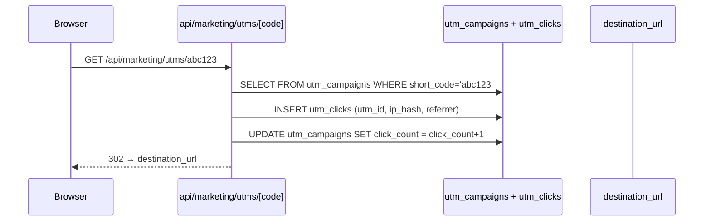

# Analytics & marketing scoring

Event ingest from the marketing site, UTM short-link tracking,
content attribution, and the daily lead-score cron.

## Entry points

- UI: `app/(dashboard)/analytics/`, `analytics/funnel`,
  `analytics/agencies`, `analytics/utms`
- API: `app/api/marketing/events/route.ts`,
  `app/api/marketing/attribution/route.ts`,
  `app/api/marketing/score/route.ts`,
  `app/api/marketing/score/cron/route.ts` (06:00 UTC daily),
  `app/api/marketing/utms/route.ts`,
  `app/api/marketing/utms/[code]/route.ts`,
  `app/api/marketing/brief/route.ts`

## Event → attribution → score

```mermaid
flowchart LR
    subgraph Marketing site
        Visitor[Visitor]
    end
    Visitor -->|page view| EV[POST api/marketing/events]
    Visitor -->|UTM click| UC[GET api/marketing/utms/[code]<br/>redirect to destination]
    EV --> ME[(marketing_events)]
    UC --> UCT[(utm_clicks)]

    subgraph Resolution
        UCT -. cookie / session join .-> AT[POST api/marketing/attribution]
    end
    AT --> CA[(content_attribution<br/>touch_type=first/last/assist)]

    subgraph Daily cron 06:00
        CRON[api/marketing/score/cron]
    end
    CRON --> CA
    CRON --> ME
    CRON --> SC[UPSERT lead_scores<br/>score 0-100, scoring_version]
```

## UTM short-link click



## Tables touched

| Table | Read | Write |
|---|:-:|:-:|
| `marketing_events` | ✓ | ✓ |
| `utm_campaigns` | ✓ | ✓ |
| `utm_clicks` | ✓ | ✓ |
| `content_attribution` | ✓ | ✓ |
| `lead_scores` | ✓ | ✓ (cron) |
| `outreach_contacts` | ✓ | — (resolves visitor → contact) |
| `blog_posts` | ✓ | — |
