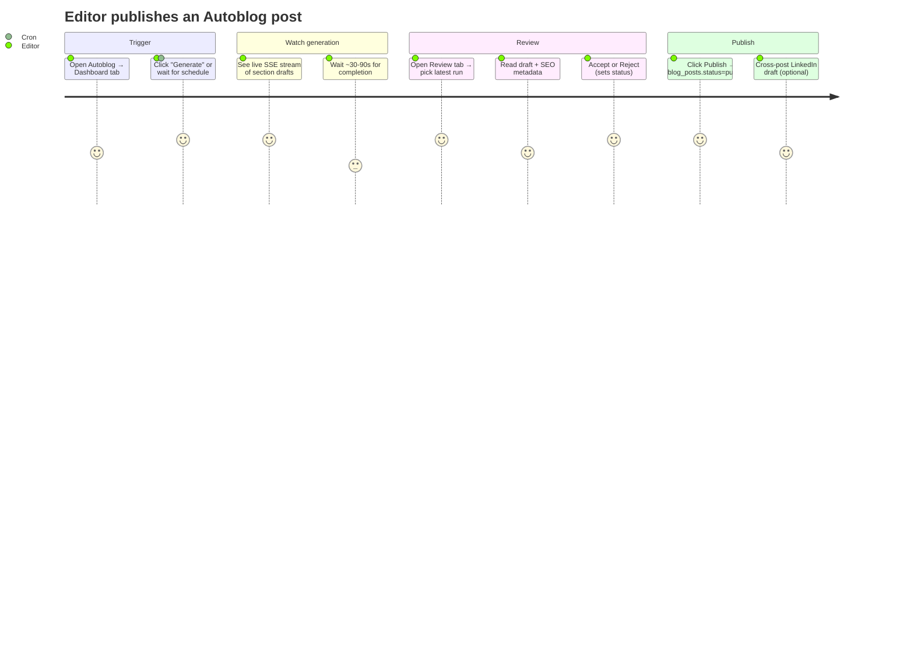
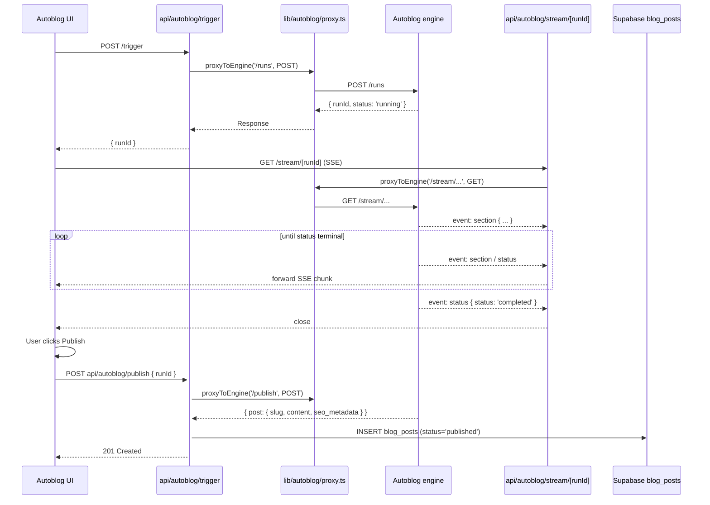

# Autoblog

AI-assisted blog generation. The admin app is a thin shell over an
external generation engine (`AUTOBLOG_ENGINE_URL`) — the engine owns
the LLM call, the run table, and the SSE stream; the admin owns the
review UI, the publish trigger, and the settings.

## Entry points

- UI: `app/(dashboard)/autoblog/` (tabs: Dashboard, Review, Settings)
- API: `app/api/autoblog/{trigger,runs,run/[runId],stream/[runId],review,publish,settings,health}/route.ts`
- Engine boundary: `lib/autoblog/proxy.ts`
- Types: `lib/types/autoblog.ts`

## User journey

## Generation pipeline

## Tables touched

| Table | Read | Write | Notes |
|---|:-:|:-:|---|
| `autoblog_runs` (external) | ✓ | ✓ | Owned by engine, not in `supabase/migrations/` |
| `autoblog_settings` (external) | ✓ | ✓ | Same |
| `blog_posts` | ✓ | ✓ | Admin writes on publish; status flows draft→published |
| `linkedin_drafts` | ✓ | ✓ | Optional cross-post on publish |

## External services

- Autoblog engine at `process.env.AUTOBLOG_ENGINE_URL`
  (default `https://rfp-blog.vercel.app`).
- Network failures wrapped in `EngineUnreachableError`
  (`lib/autoblog/proxy.ts:4`).

## See also

- State machine: [`state-machines/autoblog-runs.md`](../state-machines/autoblog-runs.md)
- State machine: [`state-machines/blog-posts.md`](../state-machines/blog-posts.md)
