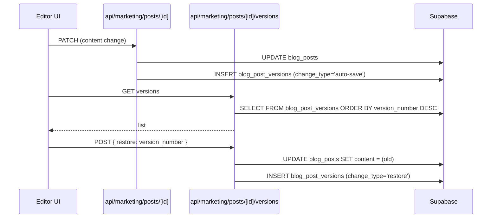

# Content / CMS

Hand-authored and AI-assisted blog posts with reviewer workflow,
version history, tags/topics, and LinkedIn cross-posting.

## Entry points

- UI: `app/(dashboard)/posts/`, `app/(dashboard)/posts/[id]/`,
  `app/(dashboard)/posts/calendar/`
- API: `app/api/marketing/posts/*`, `app/api/marketing/tags/`,
  `app/api/marketing/topics/`

## Editor → publish flow

```mermaid
flowchart LR
    A[Editor opens posts/new] --> B[POST api/marketing/posts<br/>status=draft]
    B --> C[Editor writes content<br/>auto-saves to versions]
    C --> D[Set buyer_stage,<br/>content_type, tags, topics]
    D --> E[Submit for review<br/>status=review]
    E --> F{Reviewer<br/>verdict}
    F -- approve --> G[status=approved]
    F -- request changes --> C
    G --> H[POST posts/[id]/publish<br/>status=published<br/>published_at=now]
    H --> I[Optional:<br/>linkedin_drafts INSERT]
    H --> J[utm_campaigns can target post_id]
    G --> K[Archive<br/>status=archived]
```

## Version history

`blog_post_versions` is append-only. Every save writes a row with
`change_type` ∈ {auto-save, manual-save, status-change, approval,
restore}. Restore loads a prior version's `content` jsonb back into
the live row.



## Tables touched

| Table | Read | Write |
|---|:-:|:-:|
| `blog_posts` | ✓ | ✓ |
| `blog_post_versions` | ✓ | ✓ |
| `blog_post_tags`, `blog_tags` | ✓ | ✓ |
| `blog_post_topics`, `blog_topics` | ✓ | ✓ |
| `linkedin_drafts` | ✓ | ✓ |
| `media_library` | ✓ | ✓ |

## See also

- [`state-machines/blog-posts.md`](../state-machines/blog-posts.md)
- [`state-machines/blog-post-versions.md`](../state-machines/blog-post-versions.md)
- [`state-machines/linkedin-drafts.md`](../state-machines/linkedin-drafts.md)
