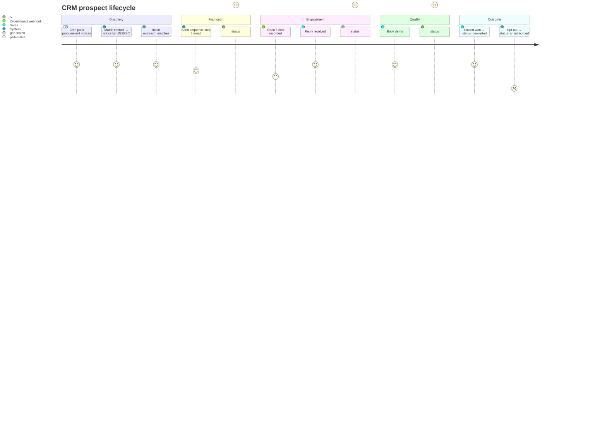
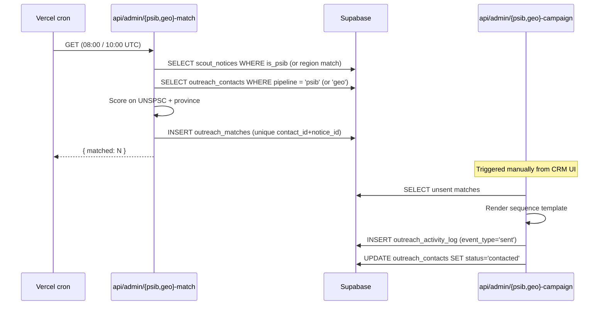

# CRM / Outreach

Prospect lifecycle for PSIB (Procurement Strategy for Indigenous
Business) and GEO (geographic) outbound pipelines, plus an ABM
(account-based marketing) account view.

## Entry points

- UI: `app/(dashboard)/crm/`, `app/(dashboard)/crm/[id]/`,
  `app/(dashboard)/crm/accounts/`, `app/(dashboard)/crm/geo/`
- API: `app/api/admin/crm/`, `app/api/admin/crm/[id]/`,
  `app/api/admin/crm/accounts/`, `app/api/admin/crm/accounts/[id]/`
- Match crons: `app/api/admin/psib-match/route.ts` (08:00 UTC daily),
  `app/api/admin/geo-match/route.ts` (10:00 UTC daily)
- Campaign senders: `app/api/admin/psib-campaign/route.ts`,
  `app/api/admin/geo-campaign/route.ts`

## Prospect journey

## Match cron pipeline

## Tables touched

| Table | Read | Write |
|---|:-:|:-:|
| `outreach_contacts` | ✓ | ✓ |
| `outreach_sequences` | ✓ | — |
| `outreach_activity_log` | ✓ | ✓ (append-only events) |
| `outreach_matches` | ✓ | ✓ |
| `scout_notices` | ✓ | — (read-only; marketing repo owns writes) |
| `abm_accounts` | ✓ | ✓ |
| `abm_account_contacts` | ✓ | ✓ |
| `lead_scores` | ✓ | — (written by `api/marketing/score/cron`) |

## See also

- [`state-machines/outreach-contacts.md`](../state-machines/outreach-contacts.md)
- [`analytics-marketing.md`](./analytics-marketing.md) for the lead-score cron
