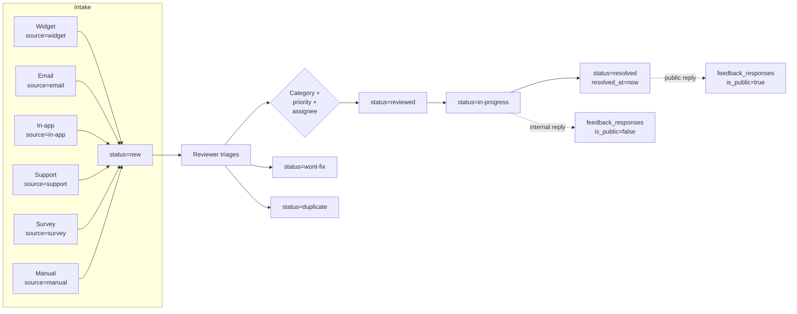

# Feedback

Customer feedback intake (in-app widget, email, manual), triage,
and response workflow.

## Entry points

- UI: `app/(dashboard)/feedback/`
- API: `app/api/feedback/route.ts` (list/create),
  `app/api/feedback/[id]/route.ts` (read/update),
  `app/api/feedback/[id]/respond/route.ts` (internal reply),
  `app/api/feedback/widget/route.ts` (anonymous public submit)

## Triage flow

## Tables touched

| Table | Read | Write |
|---|:-:|:-:|
| `feedback` | ✓ | ✓ |
| `feedback_responses` | ✓ | ✓ |
| `customers` | ✓ | — (join for submitter context) |
| `outreach_contacts` | ✓ | — (join for submitter context) |

## See also

- [`state-machines/feedback.md`](../state-machines/feedback.md)
