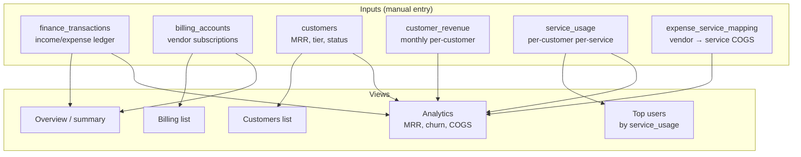

# Finance & billing

Internal finance dashboard: vendor spend (Supabase, Vercel,
Anthropic…), customer revenue, tiers, top users, and
income/expense ledger.

## Entry points

- UI: `app/(dashboard)/finance/` (overview), `finance/analytics`,
  `finance/billing`, `finance/customers`, `finance/top-users`
- API: `app/api/finance/{summary,analytics,billing,customers,tiers,transactions,top-users}/*/route.ts`

## Data flow

## Tables touched

| Table | Read | Write |
|---|:-:|:-:|
| `finance_transactions` | ✓ | ✓ |
| `billing_accounts` | ✓ | ✓ |
| `customers` | ✓ | ✓ |
| `customer_tiers` | ✓ | ✓ |
| `customer_revenue` | ✓ | ✓ |
| `service_usage` | ✓ | ✓ |
| `expense_service_mapping` | ✓ | ✓ |

## See also

- [`state-machines/billing-accounts.md`](../state-machines/billing-accounts.md)
- [`state-machines/customers.md`](../state-machines/customers.md)
