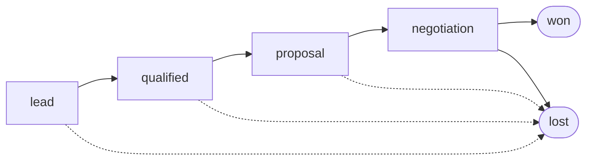
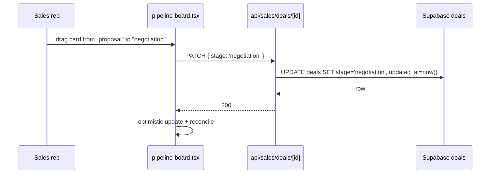

# Sales pipeline

Kanban-style deal board tracking opportunities from lead through
won/lost.

## Entry points

- UI: `app/(dashboard)/sales/`
- API: `app/api/sales/deals/route.ts`, `app/api/sales/deals/[id]/route.ts`
- Component: `components/sales/pipeline-board.tsx`

## Deal flow

Dotted edges = early disqualification; any stage can move to `lost`.

## Drag-to-update UX

## Tables touched

| Table | Read | Write |
|---|:-:|:-:|
| `deals` | ✓ | ✓ |
| `outreach_contacts` | ✓ | — (join for contact name) |
| `abm_accounts` | ✓ | — |

## See also

- [`state-machines/deals.md`](../state-machines/deals.md)
