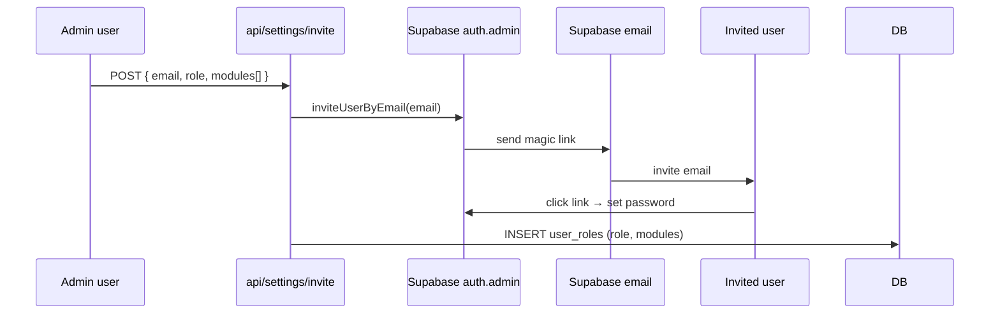

# Settings / RBAC

User profile, user list (admin-only), invite flow, and the
role/module-based access control that gates the sidebar.

## Entry points

- UI: `app/(dashboard)/settings/`, `settings/profile`, `settings/users`
- API: `app/api/settings/invite/route.ts`,
  `app/api/settings/users/[id]/route.ts`
- RBAC: `lib/auth/roles.ts`
- Schema: `supabase/migrations/20260324000009_user_roles.sql`,
  `supabase/migrations/20260430000001_user_roles_all_modules.sql`

## Module access gate

```mermaid
flowchart LR
    L[Login via Supabase Auth] --> M[middleware reads<br/>auth.users.id]
    M --> R[SELECT user_roles<br/>WHERE user_id=auth.uid]
    R --> RC{role + modules}
    RC -- modules contains "content" --> CV[/posts, /autoblog visible/]
    RC -- modules contains "crm" --> CRM[/crm visible/]
    RC -- modules contains "analytics" --> AN[/analytics visible/]
    RC -- modules contains "system" --> SYS[/audit, /system-health, /settings/users visible/]
    RC -- role=admin --> ALL[all modules forced on]
```

## Invite flow



## Tables touched

| Table | Read | Write |
|---|:-:|:-:|
| `user_roles` | ✓ | ✓ |
| `auth.users` (Supabase) | ✓ | ✓ (via auth.admin API) |
