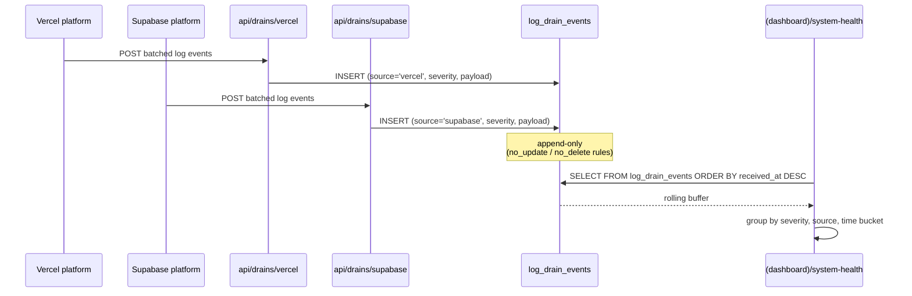

# System health

Admin-only observability dashboard fed by Vercel + Supabase log
drains.

## Entry points

- UI: `app/(dashboard)/system-health/`
- Webhooks: `app/api/drains/vercel/route.ts`,
  `app/api/drains/supabase/route.ts`
- Schema: `supabase/migrations/20260417000001_log_drain_events.sql`
- Docs: `docs/log-drains.md`

## Ingest → dashboard flow

## Immutability guard

Same pattern as `audit_log`: the migration installs `no_update` and
`no_delete` rules, so log retention/rotation must happen via
scheduled `TRUNCATE` (not yet wired) or partition pruning.

## Tables touched

| Table | Read | Write |
|---|:-:|:-:|
| `log_drain_events` | ✓ (UI) | ✓ (webhooks only) |
