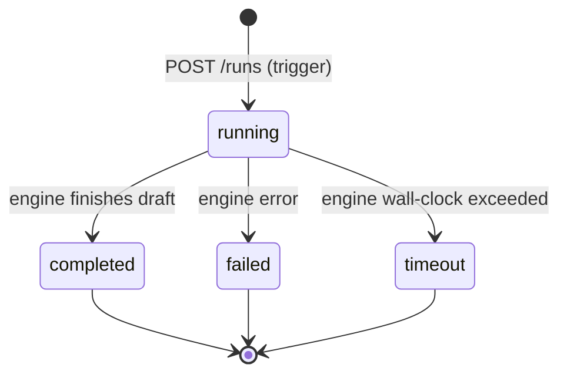

# `autoblog_runs.status`

Status of a single run of the external Autoblog engine.

> **Reconciled 2026-06-15 vs live DB CHECK constraint.** The live
> `autoblog_runs.status` CHECK allows EXACTLY four values:
> `{running, completed, failed, timeout}`. The earlier docs/TS described a
> six-value union (adding `published` and `rejected`); those two are NOT run
> statuses — they belong to the content lifecycle on `blog_posts.status`. The
> run status records only how the *execution* ended.

## ⚠ Cross-system entity — drift risk

This table lives in the **external engine's** Supabase project,
not in `Project_Tendriv-Admin/supabase/migrations/`. The admin app
reads/writes via `lib/autoblog/proxy.ts` and mirrors the status
enum as a TS union.

| Concern | Where |
|---|---|
| Schema (CHECK / enum) | external engine repo at `AUTOBLOG_ENGINE_URL` |
| Admin's mirror | `lib/types/autoblog.ts:6` — `export type AutoblogRunStatus = 'running' \| 'completed' \| 'failed' \| 'timeout'` (reconciled 2026-06-15 vs live DB CHECK constraint) |
| Boundary | `lib/autoblog/proxy.ts:1` (`ENGINE_URL`, `proxyToEngine`) |
| Wraps network errors | `EngineUnreachableError` at `lib/autoblog/proxy.ts:4` |

**Drift symptoms to watch for:**
- Engine renames or adds a status → admin's TS union no longer matches → status badges and switch statements silently fall through.
- Engine returns a value not in `AutoblogRunStatus` → TS `as AutoblogRunStatus` assertion at fetch time will be a lie at runtime.

## States and transitions

Editorial outcomes (publish / reject) are tracked on `blog_posts.status`, not
on the run. The run is terminal once it reaches `completed`, `failed`, or
`timeout` (reconciled 2026-06-15 vs live DB CHECK constraint).

## Transition table

| from | to | trigger | actor | file |
|---|---|---|---|---|
| (none) | `running` | POST `/api/autoblog/trigger` | user / cron | `app/api/autoblog/trigger/route.ts` |
| `running` | `completed` | engine emits `event: status` on SSE | engine | `app/api/autoblog/stream/[runId]/route.ts` |
| `running` | `failed` | engine error | engine | same |
| `running` | `timeout` | engine wall-clock | engine | same |

Publish / reject are editorial transitions on `blog_posts.status`, not run
transitions (reconciled 2026-06-15 vs live DB CHECK constraint). The publish
handler (`app/api/autoblog/publish/route.ts`) and review handler
(`app/api/autoblog/review/route.ts`) write the `blog_posts` row; the run stays
at `completed`.

## Source of truth

- **External:** Autoblog engine's `autoblog_runs.status` CHECK
  constraint at `AUTOBLOG_ENGINE_URL`. Not visible from this repo;
  there is **no CI guard** verifying the admin's TS union matches.
- **Admin mirror:** `lib/types/autoblog.ts:6`
  (`AutoblogRunStatus`).
- **UI consumers:** `components/autoblog/run-history-table.tsx`,
  `components/autoblog/status-badge.tsx`,
  `components/autoblog/live-stream-panel.tsx`,
  `components/autoblog/run-detail-panel.tsx` (verify each
  switch/badge handles all 4 values).

## Known drift risks

1. **No migration in this repo** — when adding a new status, the
   engine must ship first, then this repo's `AutoblogRunStatus`,
   then the UI badge map. Skipping any step yields a silent
   "unknown" badge.
2. **Publish does not change the run status** (reconciled
   2026-06-15 vs live DB CHECK constraint) — publishing INSERTs/updates a
   `blog_posts` row and the post's lifecycle lives on `blog_posts.status`. The
   run stays at `completed` regardless. Earlier docs treated `published` as a
   run status; the live CHECK rejects it. Watch for code that still tries to
   write `status='published'` to `autoblog_runs` — it will throw.
