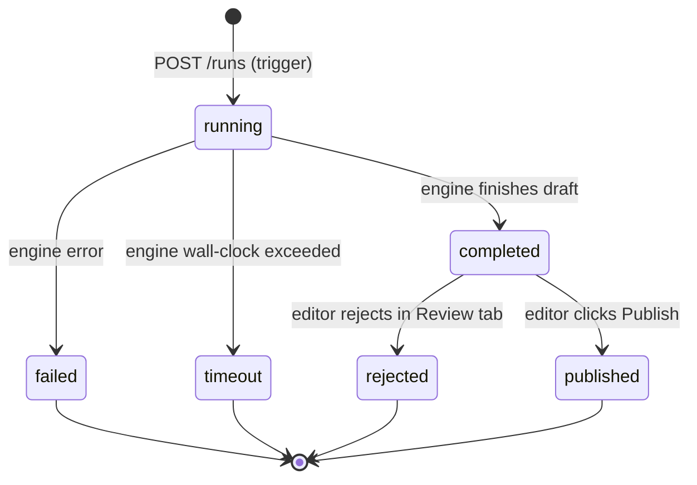

# `autoblog_runs.status`

Status of a single run of the external Autoblog engine.

## ⚠ Cross-system entity — drift risk

This table lives in the **external engine's** Supabase project,
not in `Project_Tendriv-Admin/supabase/migrations/`. The admin app
reads/writes via `lib/autoblog/proxy.ts` and mirrors the status
enum as a TS union.

| Concern | Where |
|---|---|
| Schema (CHECK / enum) | external engine repo at `AUTOBLOG_ENGINE_URL` |
| Admin's mirror | `lib/types/autoblog.ts:6` — `export type AutoblogRunStatus = 'running' \| 'completed' \| 'published' \| 'failed' \| 'rejected' \| 'timeout'` |
| Boundary | `lib/autoblog/proxy.ts:1` (`ENGINE_URL`, `proxyToEngine`) |
| Wraps network errors | `EngineUnreachableError` at `lib/autoblog/proxy.ts:4` |

**Drift symptoms to watch for:**
- Engine renames or adds a status → admin's TS union no longer matches → status badges and switch statements silently fall through.
- Engine returns a value not in `AutoblogRunStatus` → TS `as AutoblogRunStatus` assertion at fetch time will be a lie at runtime.

## States and transitions

## Transition table

| from | to | trigger | actor | file |
|---|---|---|---|---|
| (none) | `running` | POST `/api/autoblog/trigger` | user / cron | `app/api/autoblog/trigger/route.ts` |
| `running` | `completed` | engine emits `event: status` on SSE | engine | `app/api/autoblog/stream/[runId]/route.ts` |
| `running` | `failed` | engine error | engine | same |
| `running` | `timeout` | engine wall-clock | engine | same |
| `completed` | `published` | POST `/api/autoblog/publish` | user | `app/api/autoblog/publish/route.ts` |
| `completed` | `rejected` | POST `/api/autoblog/review` (reject) | user | `app/api/autoblog/review/route.ts` |

## Source of truth

- **External:** Autoblog engine's `autoblog_runs.status` CHECK
  constraint at `AUTOBLOG_ENGINE_URL`. Not visible from this repo;
  there is **no CI guard** verifying the admin's TS union matches.
- **Admin mirror:** `lib/types/autoblog.ts:6`
  (`AutoblogRunStatus`).
- **UI consumers:** `components/autoblog/run-history-table.tsx`,
  `components/autoblog/status-badge.tsx`,
  `components/autoblog/live-stream-panel.tsx`,
  `components/autoblog/run-detail-panel.tsx` (verify each
  switch/badge handles all 6 values).

## Known drift risks

1. **No migration in this repo** — when adding a new status, the
   engine must ship first, then this repo's `AutoblogRunStatus`,
   then the UI badge map. Skipping any step yields a silent
   "unknown" badge.
2. **`published` is a derived state** — the engine sets it only
   after the admin POSTs `/publish` and the engine confirms. If
   the admin INSERTs the `blog_posts` row but the publish call to
   the engine fails, the run stays in `completed` while the post
   is live — call this out in the publish handler.
