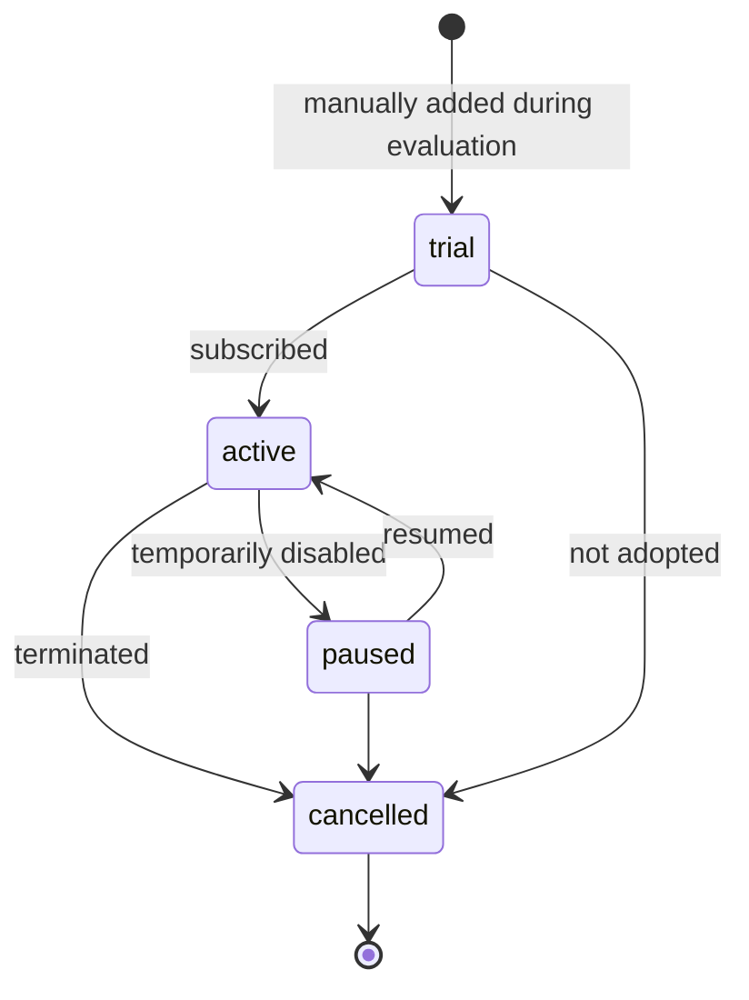

# `billing_accounts.status`

State of a vendor subscription tracked for internal finance
(Supabase, Vercel, Anthropic, etc.). This is **not** customer
billing — see [`customers.md`](./customers.md) for that.

## States and transitions



## Transition table

| from | to | trigger | actor | file |
|---|---|---|---|---|
| (none) | `active` \| `trial` | admin creates row | finance admin | `app/api/finance/billing/route.ts` |
| any | any | PATCH | finance admin | `app/api/finance/billing/[id]/route.ts` |

All transitions are manual today — there is no integration with
the vendor APIs.

## Source of truth

- **Migration:** `supabase/migrations/20260327000001_finance.sql:36`
  ```sql
  status text not null default 'active' check (status in ('active', 'paused', 'cancelled', 'trial'))
  ```
- **Related CHECK in same migration:**
  `billing_cycle` (line 34) — `monthly|yearly|usage-based`.
- **Generated TS:** `types/database.types.ts`.

## Known drift risks

1. **Pure documentation state** — nothing in the app verifies the
   listed cost/status reflects reality at the vendor. Treat as a
   ledger, not an integration.
2. **`next_billing_date` is not advanced automatically** — if you
   add a cron later, ensure it doesn't move a `cancelled` row.
