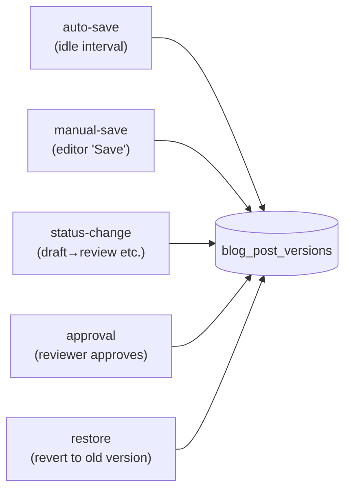

# `blog_post_versions.change_type`

Not a lifecycle state machine — a **classifier** marking why each
immutable version row was inserted. Documented here so reviewers
know the closed set and how restore works.

## Values



Each row is `(post_id, version_number, content jsonb, changed_by,
change_type, created_at)`. The `(post_id, version_number)` pair is
UNIQUE — version numbers are caller-assigned and monotonic.

## Insert table

| change_type | When inserted | Caller |
|---|---|---|
| `auto-save` | Idle-timer in editor | `app/(dashboard)/posts/[id]/...` via PATCH |
| `manual-save` | Editor presses Save | same |
| `status-change` | Status transition (`draft→review` etc.) | `app/api/marketing/posts/[id]/route.ts` |
| `approval` | Reviewer approves | same |
| `restore` | UI restores an old version | `app/api/marketing/posts/[id]/versions/route.ts` |

## Source of truth

- **Migration:** `supabase/migrations/20260324000003_blog_versions.sql:10`
  ```sql
  change_type text NOT NULL CHECK (change_type IN ('auto-save','manual-save','status-change','approval','restore'))
  ```
- **No TS mirror** today; callers pass string literals. **Drift
  risk:** typo at the call site (e.g. `'autosave'` vs `'auto-save'`)
  becomes a runtime CHECK violation. Wrap calls in a typed helper
  or Zod enum.
