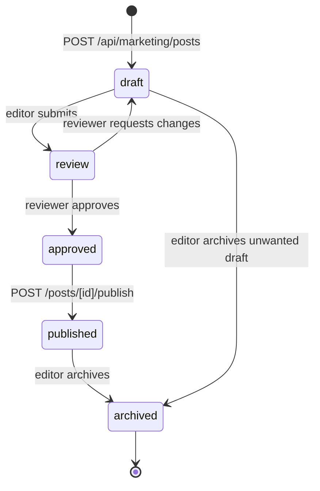

# `blog_posts.status`

Lifecycle of a single blog post, from initial draft through
reviewer approval to publication or archival.

## States and transitions



## Transition table

| from | to | trigger | actor | file |
|---|---|---|---|---|
| (none) | `draft` | POST `/api/marketing/posts` | editor | `app/api/marketing/posts/route.ts` |
| `draft` | `review` | PATCH status | editor | `app/api/marketing/posts/[id]/route.ts` |
| `review` | `approved` | PATCH status | reviewer | same |
| `review` | `draft` | PATCH status (changes requested) | reviewer | same |
| `approved` | `published` | POST `/api/marketing/posts/[id]/publish` (sets `published_at`) | editor | `app/api/marketing/posts/[id]/publish/route.ts` |
| any | `archived` | PATCH status | editor | `app/api/marketing/posts/[id]/route.ts` |

A `blog_post_versions` row is inserted on every status change with
`change_type='status-change'` — see
[`blog-post-versions.md`](./blog-post-versions.md).

## Source of truth

- **Migration:** `supabase/migrations/20260324000001_blog_posts.sql:26`
  ```sql
  status text NOT NULL DEFAULT 'draft' CHECK (status IN ('draft','review','approved','published','archived'))
  ```
- **Generated TS:** `types/database.types.ts` —
  `Database['public']['Tables']['blog_posts']['Row']['status']`
  (string; not a literal union until Zod narrows it).
- **Related fields that imply state:**
  - `published_at` — must be set when transitioning to `published`.
  - `scheduled_at` — future publish; UI shows as "scheduled" but
    `status` stays `approved` until the trigger fires.

## Known drift risks

1. **`scheduled_at` is not a status** — a post with
   `status='approved'` and `scheduled_at > now()` looks "scheduled"
   in the UI, but the actual transition to `published` is whatever
   handler advances it. Today there is **no cron** flipping
   scheduled posts; the publish API call is required.
2. **`reviewer_id` should be set on review→approved** — the schema
   doesn't enforce non-null, so a bug could approve a post without
   recording who approved it.
