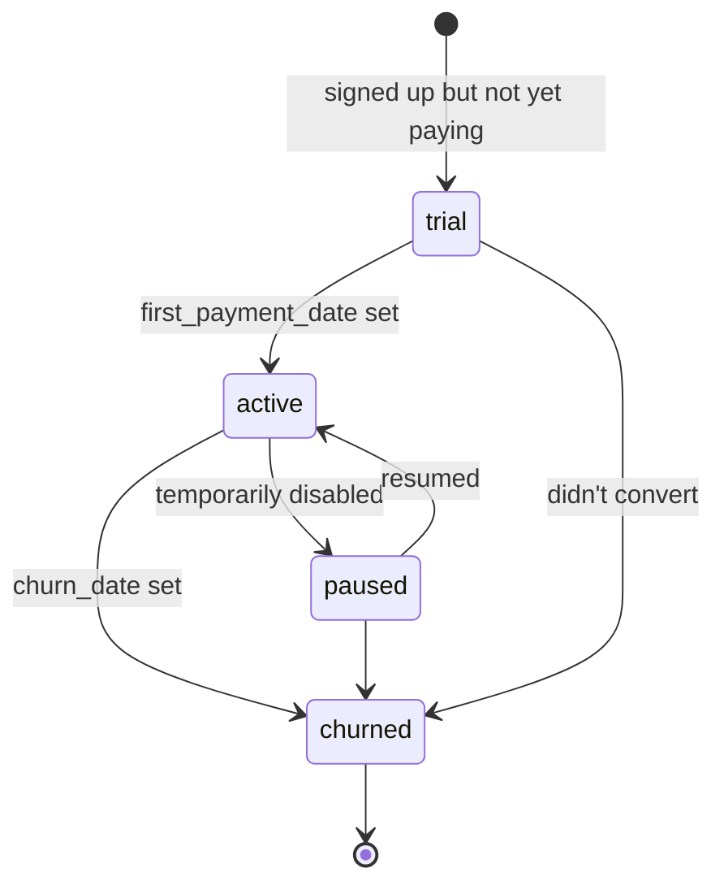

# `customers.status`

State of a paying customer (or trialing customer). Separate from
internal `billing_accounts` which tracks vendor subscriptions
*we* pay.

## States and transitions



## Transition table

| from | to | trigger | actor | file |
|---|---|---|---|---|
| (none) | `trial` \| `active` | INSERT | finance admin | `app/api/finance/customers/route.ts` |
| any | any | PATCH | finance admin | `app/api/finance/customers/[id]/route.ts` |

Today all transitions are manual. When wiring Stripe webhooks, the
handler should map Stripe events to status transitions and write
`first_payment_date` / `churn_date` in the same UPDATE.

## Source of truth

- **Migration:** `supabase/migrations/20260327000002_customer_tiers_and_usage.sql:20-21`
  ```sql
  status text not null default 'active'
    check (status in ('active', 'churned', 'trial', 'paused'))
  ```
- **Related table:** `customer_revenue` carries a `type` CHECK
  (`subscription|one-time|overage|refund`, line 49) — orthogonal
  to customer status.
- **Generated TS:** `types/database.types.ts`.

## Known drift risks

1. **`first_payment_date` / `churn_date` coupling** — must be set
   in the handler that flips `status`, since the schema doesn't
   require it.
2. **`mrr` should be 0 when `churned`** — not enforced; analytics
   could double-count without this invariant.
3. **Status values differ from `billing_accounts`** — customers
   use `churned`, vendors use `cancelled`. Don't unify without a
   migration on both.
