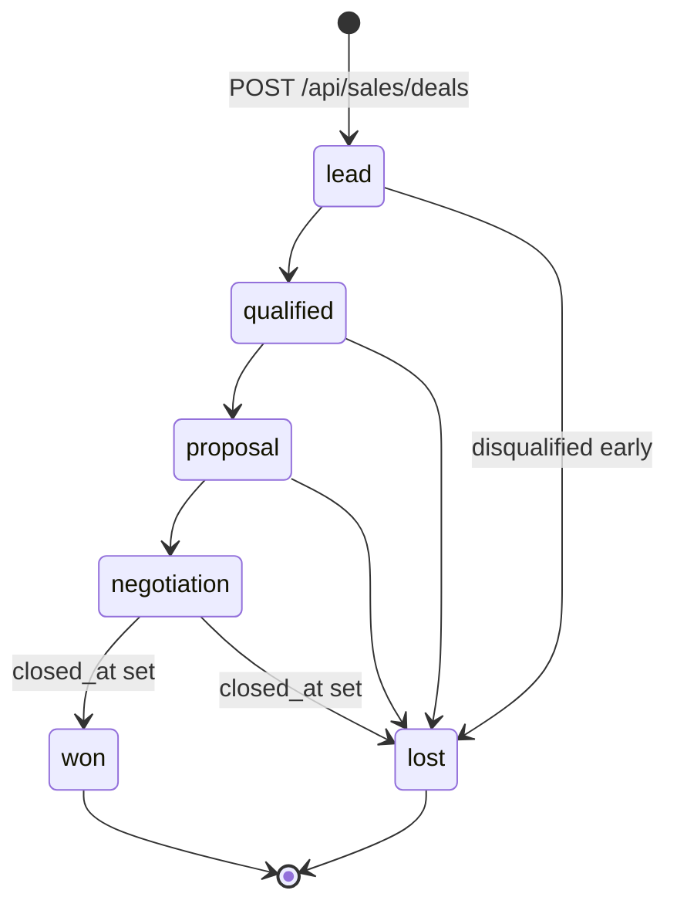

# `deals.stage`

Sales pipeline stages used by `app/(dashboard)/sales/` and the
`components/sales/pipeline-board.tsx` Kanban.

## States and transitions



## Transition table

| from | to | trigger | actor | file |
|---|---|---|---|---|
| (none) | `lead` | POST `/api/sales/deals` | user | `app/api/sales/deals/route.ts` |
| any | any | PATCH `/api/sales/deals/[id]` (drag card) | user | `app/api/sales/deals/[id]/route.ts` |
| `negotiation` | `won` \| `lost` | PATCH stage; should also set `closed_at` | user | same |

The schema does **not** enforce that `closed_at` is set when
`stage` becomes `won` or `lost`. The PATCH handler should do this
on the server side.

## Source of truth

- **Migration:** `supabase/migrations/20260326000001_deals.sql:7-8`
  ```sql
  stage text not null default 'lead'
    check (stage in ('lead','qualified','proposal','negotiation','won','lost'))
  ```
- **Generated TS:** `types/database.types.ts`.

## Known drift risks

1. **`closed_at` is not coupled to `stage`** — a deal at `won` with
   `closed_at IS NULL` is technically valid by the DB. Add a
   trigger or handler invariant if win/loss timing matters for
   analytics.
2. **No "paused" or "on-hold" state** — if a deal stalls, it sits
   in its current stage indefinitely. Consider whether you need a
   neutral state before adding rows that fall outside the CHECK.
