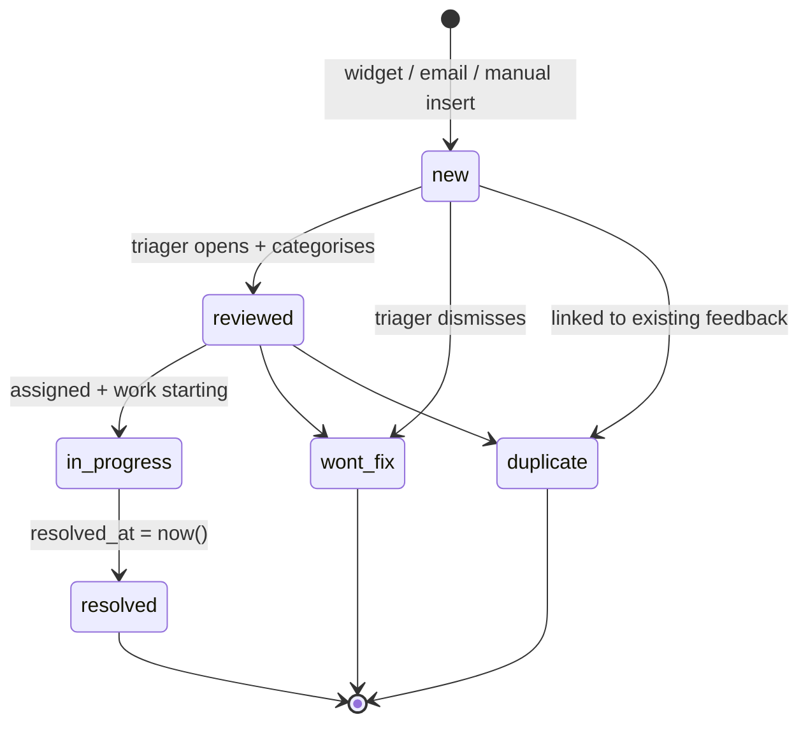

# `feedback.status`

Triage lifecycle of a customer feedback submission.

## States and transitions



Note: hyphenated state names (`in-progress`, `wont-fix`) are
rendered as `in_progress`, `wont_fix` in the diagram because
Mermaid state IDs can't contain hyphens. The DB values are the
hyphenated forms.

## Transition table

| from | to (DB value) | trigger | actor | file |
|---|---|---|---|---|
| (none) | `new` | widget submit / email / manual | submitter / admin | `app/api/feedback/widget/route.ts`, `app/api/feedback/route.ts` |
| `new` | `reviewed` | PATCH | triager | `app/api/feedback/[id]/route.ts` |
| `reviewed` | `in-progress` | PATCH (assignee set) | triager | same |
| `in-progress` | `resolved` | PATCH (sets `resolved_at`) | assignee | same |
| any | `wont-fix` | PATCH | triager | same |
| any | `duplicate` | PATCH | triager | same |

Internal/public replies live in `feedback_responses` and don't
change the parent's status.

## Source of truth

- **Migration:** `supabase/migrations/20260327000003_feedback.sql:22-23`
  ```sql
  status text not null default 'new'
    check (status in ('new', 'reviewed', 'in-progress', 'resolved', 'wont-fix', 'duplicate'))
  ```
- **Related CHECKs in the same migration:**
  - `source` (line 6) — `widget|email|in-app|support|survey|manual`
  - `category` (line 15) — `bug|feature-request|ux|performance|content|billing|general|praise`
  - `sentiment` (line 16) — `positive|neutral|negative|null`
  - `priority` (line 25) — `low|medium|high|critical`
- **Generated TS:** `types/database.types.ts`.

## Known drift risks

1. **`resolved_at` is not coupled to `status='resolved'`** — must
   be enforced in the PATCH handler.
2. **No state for "won't fix because duplicate"** — `duplicate`
   and `wont-fix` are siblings, so the UI must show the linked
   feedback id separately when status is `duplicate`.
