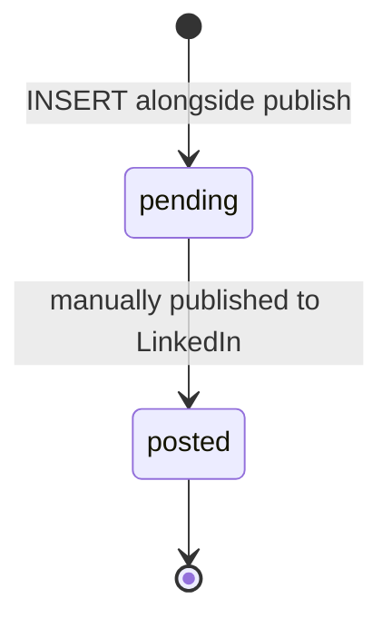

# `linkedin_drafts.status`

Cross-post copy generated for LinkedIn alongside a published
blog post. Smallest state machine in the system.

## States and transitions



## Transition table

| from | to | trigger | actor | file |
|---|---|---|---|---|
| (none) | `pending` | INSERT (typically alongside `blog_posts.status='published'`) | editor | `app/api/marketing/posts/[id]/publish/route.ts` (or admin handler that fans out) |
| `pending` | `posted` | manual confirmation from editor | editor | `app/api/marketing/posts/[id]/route.ts` (or a dedicated endpoint) |

No automation today — `posted` is a manual flag.

## Source of truth

- **Migration:** `supabase/migrations/20260324000008_linkedin_drafts.sql:8`
  ```sql
  status text NOT NULL DEFAULT 'pending' CHECK (status IN ('pending','posted'))
  ```
- **Generated TS:** `types/database.types.ts`.

## Known drift risks

1. **No `failed` or `cancelled` state** — if LinkedIn rejects the
   post, today the row stays `pending` forever. Add states before
   wiring the LinkedIn API.
2. **No `posted_at` column** — engagement analytics will need it
   when added.
