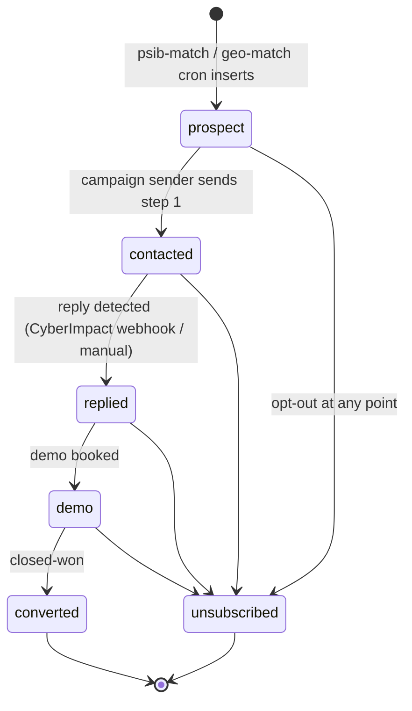

# `outreach_contacts.status`

Prospect lifecycle in the CRM. Same table is read by the marketing
repo for monitor-digest matching.

## States and transitions



## Transition table

| from | to | trigger | actor | file |
|---|---|---|---|---|
| (none) | `prospect` | psib-match / geo-match cron inserts new contact | cron | `app/api/admin/psib-match/route.ts`, `app/api/admin/geo-match/route.ts` |
| `prospect` | `contacted` | campaign sender sends step 1 email | system | `app/api/admin/psib-campaign/route.ts`, `app/api/admin/geo-campaign/route.ts` |
| `contacted` | `replied` | reply detected | webhook / user | `app/api/admin/crm/[id]/route.ts` (manual), CyberImpact webhook (TBD) |
| `replied` | `demo` | demo booked | user | `app/api/admin/crm/[id]/route.ts` |
| `demo` | `converted` | closed-won | user | same |
| any | `unsubscribed` | opt-out / CyberImpact bounce | webhook | same |

## Pipeline classifier (orthogonal)

`pipeline` is a separate non-null column with its own CHECK:

```sql
pipeline text not null check (pipeline in ('psib', 'geo', 'manual'))
```

Contacts inserted by the marketing repo (`api/marketing/monitor-subscribe`) are written with `pipeline='manual'` — see
[`../../../Project_Tendriv-Marketing/docs/diagrams/state-machines/outreach-contacts.md`](#) for the marketing-side view.

## Source of truth

- **Migration:** `supabase/migrations/20260321000000_outreach_crm.sql:12-13`
  ```sql
  status text not null default 'prospect'
    check (status in ('prospect', 'contacted', 'replied', 'demo', 'converted', 'unsubscribed'))
  ```
- **Generated TS:** `types/database.types.ts` (`Row['status']`, string).
- **Activity log mirror:** `outreach_activity_log.event_type` CHECK
  values are `('sent','opened','clicked','replied','bounced','unsubscribed')`
  (same migration, line 47) — these are **events**, not statuses;
  multiple events can hit one contact.

## Known drift risks

1. **CyberImpact ↔ status sync is manual today** — bounces and
   opt-outs in CyberImpact write to `outreach_activity_log` but the
   `outreach_contacts.status` mirror needs to be updated in the
   same handler. A drift here means a "live" contact in the CRM
   that is actually unsubscribed at the ESP.
2. **`pipeline='manual'` writes from marketing** — the marketing
   repo's monitor-subscribe handler writes contacts without going
   through the admin's normalisation. Keep the CHECK aligned by
   touching both repos when adding a pipeline value.
